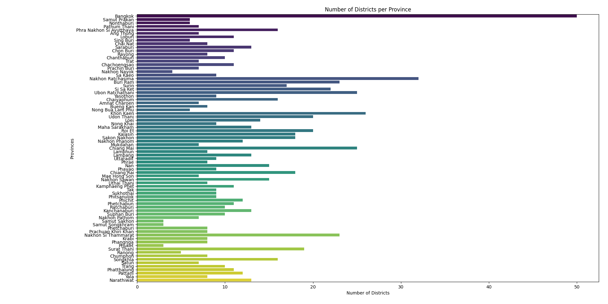

# GeoThai Analyzer

Welcome to the **GeoThai Analyzer** repository! 🌏📊 This toolset is designed to **integrate, analyze, and visualize** Thailand’s geographic data, from provinces to subdistricts. It is perfect for developers, GIS professionals, and anyone interested in Thailand's geography.

## 📊 Data Analysis and Visualization

With this repository, you can:
- **Integrate** various geographic datasets into a unified structure.
- **Analyze** relationships between different geographic levels, such as the number of districts per province.
- **Visualize** the data through various plots and maps to gain insights.

## 🖼️ Images

Here are some visualizations you can create using this repository:


*Bar chart showing the number of districts per province.*


*Pie chart displaying the distribution of subdistricts in selected districts of Bangkok.*


## 🛠️ Usage

To use this repository, follow these steps:

1. **Clone the repository**:
    ```bash
    git clone https://github.com/GeoThai/analyzer.git
    cd analyzer
    ```

2. **Install the required dependencies**:
    ```bash
    pip install -r requirements.txt
    ```

3. **Run the integration script**:
    ```bash
    python scripts/integrate_data.py
    ```
    This will generate an integrated dataset saved in `data/integrated_data.json`.

4. **Analyze the data**:
    ```bash
    python scripts/analyze_data.py
    ```
    This script will output key insights about the number of districts per province and subdistricts per district.

5. **Visualize the data**:
    ```bash
    python scripts/visualize_data.py
    ```
    This will generate various visualizations such as bar charts, pie charts, and geographic maps.

## 🔧 Scripts Overview

### `scripts/analyze_data.py`

This script analyzes the geographic data to extract meaningful insights:
- **Districts per Province**: Counts the number of districts in each province.
- **Subdistricts per District**: Counts the number of subdistricts in each district.
- **Key Findings**: Identifies the province with the most districts and the district with the most subdistricts.

### `scripts/integrate_data.py`

This script integrates geographic data across different levels:
- Combines provinces, districts, and subdistricts into a single JSON file.
- The output is a hierarchical data structure useful for advanced analysis and visualization.

### `scripts/visualize_data.py`

This script generates visual representations of the integrated data:
- **Bar Charts**: Display the number of districts per province.
- **Pie Charts**: Show the distribution of subdistricts in selected districts.

## 🤝 Contributing

We welcome contributions to enhance this project. Please read the [CONTRIBUTING.md](CONTRIBUTING.md) for guidelines on how to contribute.

## 📝 License

This project is licensed under the [MIT License](LICENSE). See the LICENSE file for more details.

## 🙋‍♂️ Contact

For questions, issues, or suggestions, feel free to open an issue or contact us at [pyyupsk@proton.me](mailto:pyyupsk@proton.me).

Happy analyzing! 🗺️📊
